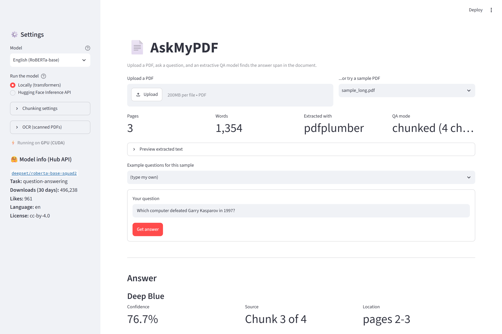

# 📄 AskMyPDF — Transformer-Based Extractive Question Answering over PDFs

Ask a question in plain language about any PDF and get the exact answer back,
with a confidence score and the passage it came from. Instead of reading a
50-page document to find one fact, the system locates the answer using a
Hugging Face **extractive question-answering** model (RoBERTa fine-tuned on SQuAD 2.0).

---

## How it works

```
 ┌──────────┐   1. Extraction    ┌────────────┐   2. Chunking     ┌─────────────────────┐
 │   PDF    │ ─────────────────► │ plain text │ ────────────────► │ 400-word chunks     │
 └──────────┘  pdfplumber        │ (per page) │  short doc: 1     │ with 50-word overlap│
      │        (PyPDF2 fallback) └────────────┘  long doc:  many  └──────────┬──────────┘
      │                              ▲                                       │
      └──── scanned? ── OCR ─────────┘  (optional, app/ocr.py)               │
                                                                             │ 3. QA inference
                                                                             ▼  (once per chunk)
 ┌─────────────────────────────────────────┐   4. Pick best    ┌─────────────────────┐
 │ answer + confidence + source chunk/page │ ◄──────────────── │ roberta-base-squad2 │
 └─────────────────────────────────────────┘  highest score    └─────────────────────┘
```

1. **Extraction** ([app/pdf_extractor.py](app/pdf_extractor.py)): `pdfplumber` rebuilds the text
   from the PDF page by page. If it fails or finds nothing, `PyPDF2` gets a try.
   Three details matter on real documents:
   - **Word spacing.** pdfplumber splits words by the gap between characters, and
     its default is too wide for LaTeX, turning lines into `WeusedtheAdamoptimizer`.
     Using `x_tolerance=1.5` took the *Attention Is All You Need* paper from 2,017
     "words" to 6,183 real ones.
   - **Two columns.** Papers and many books print two columns; read straight across
     they interleave two unrelated sentences. Pages are checked for a gutter and each
     column is read in full, in order.
   - **Hyphens.** `infor-\nmation` must be joined, but `self-\nattention` must keep its
     hyphen. The rule: keep the hyphen if the part before it also appears as a word on
     its own elsewhere in the document.
2. **Chunking** ([app/chunker.py](app/chunker.py)): a transformer can only read about
   512 tokens at once, so long documents are cut into overlapping chunks; an answer on a
   boundary is therefore complete in at least one chunk. A document that fits in a single
   chunk is passed **directly** as one context.
   The chunk size is **measured, not assumed**: the model's own tokenizer is run over a
   sample of the document, because tokens per word vary from ~1.2 (plain English) to ~2.7
   (Telugu) to 4+ (a paper full of formulas and citations). A fixed 400 words produces
   900–2,400-token chunks on real papers, far past the limit.
3. **QA inference** ([app/qa_engine.py](app/qa_engine.py)): `pipeline("question-answering")`
   reads `[question] + [chunk]` and predicts, for every token, the probability that it
   is the **start** and the **end** of the answer. The best span is the answer, and
   P(start) × P(end) is its **confidence score**. The SQuAD 2.0 models can also say
   *"no answer here"*.
4. **Selection**: each chunk also reports how strongly it would rather say *"no answer
   here"*. Chunks are ranked by the **margin** between the two — span score minus
   "no answer" score — because a raw score is normalised inside its own chunk and so
   isn't comparable across chunks. If no chunk beats its own "no answer" option, the
   app says so and still lists the closest guesses instead of discarding them.
   The winner is shown with its score, chunk number, page range and highlighted context.

## Project structure

```
nlp_project/
├── app.py                    # Streamlit UI  (streamlit run app.py)
├── app/                      # NLP logic, one file per step
│   ├── __init__.py           #   loads .env, points the model cache at /models
│   ├── config.py             #   all tunable numbers (chunk size, models, thresholds)
│   ├── ocr.py                #   step 0 (optional): OCR for scanned PDFs
│   ├── pdf_extractor.py      #   step 1: PDF -> text
│   ├── chunker.py            #   step 2: text -> overlapping chunks
│   ├── qa_engine.py          #   step 3: HF pipeline + best-answer selection
│   ├── hf_inference_api.py   #   optional: run the model on Hugging Face's servers
│   └── hub_info.py           #   model metadata from the Hugging Face Hub API
├── uploads/                  # PDFs uploaded through the UI are saved here
├── models/                   # downloaded model weights (local Hugging Face cache)
├── samples/                  # demo PDFs + expected answers
│   ├── sample_*.pdf          #   English (short/long) and French demo PDFs
│   ├── expected_answers.json #   questions + expected answers used by tests
│   └── indic_examples.json   #   Indian-language questions (11 languages)
├── testings/                 # 26 multilingual test PDFs + the questions to ask
│   ├── test_<code>_<lang>.pdf    one passage per language (same facts in each)
│   ├── ALL_QUESTIONS.pdf         every question + expected answer, to read while testing
│   ├── questions.json            the same questions, for the automated runner
│   └── test_corpus.json          the source text -- edit, then regenerate
├── scripts/
│   ├── make_sample_pdfs.py   #   regenerates samples/*.pdf (no extra libraries)
│   ├── run_examples.py       #   end-to-end demo on the sample PDFs
│   ├── run_indic_examples.py #   Indian-language demo (typed text, no PDF)
│   ├── make_test_pdfs.py     #   builds testings/*.pdf (any script, via Edge/Chrome)
│   ├── run_test_pdfs.py      #   runs every testings/ PDF and scores the answers
│   └── make_screenshot.py    #   dev tool: regenerates docs/screenshot.png
├── docs/screenshot.png       # the screenshot shown above
├── tests/test_qa_system.py   # unit + end-to-end tests
├── requirements.txt
├── .env.example              # template for HF_TOKEN -> copy to .env
└── .gitignore                # ignores .env, /models, /uploads, .venv
```

## Setup

Requires **Python 3.9+** (tested on 3.10).

```bash
python -m venv .venv
# Windows:        .venv\Scripts\activate
# macOS / Linux:  source .venv/bin/activate
pip install -r requirements.txt
```

> **Important:** `transformers` is pinned to `<5`. Version 5 **removed** the
> `question-answering` pipeline this project is built on.

The first question you ask downloads the model into `models/`
(about 500 MB for English, about 2.2 GB for multilingual). After that it runs offline.

## How to run

```bash
streamlit run app.py
```

Then open http://localhost:8501 and:

1. Upload a PDF, or pick one of the bundled samples.
2. Check the stats row: pages, word count, extraction library, and whether QA
   runs in **direct** (short doc) or **chunked** mode.
3. Type a question and click **Get answer**.
4. You'll see the **answer**, its **confidence**, **which chunk/pages** it came from,
   and the **source context** with the answer highlighted. The *"Answers from
   other chunks"* expander lists every chunk that proposed an answer (chunks that
   returned "no answer" are left out).

The sidebar lets you switch between the **English** and **Multilingual** models,
choose local vs hosted inference, adjust chunk size/overlap, pick the OCR language,
and see the model's live Hub metadata.

Other things the page offers:

- **Example questions** for the bundled sample PDFs, so you can demo without typing.
- **Question history** with a **CSV download** — handy for a report; it is saved as
  UTF-8 with BOM so Excel shows Telugu and Hindi answers correctly.
- **Download extracted text**, to check what was really read (especially after OCR).
- A warning when a non-Latin PDF is paired with the English-only model.



*Regenerate it with the app running: `python scripts/make_screenshot.py`
(needs `pip install playwright`; it is a dev tool, not a dependency).*

### Share a question as a link

The page reads three optional URL parameters, so a demo can be opened ready-answered:

```
http://localhost:8501/?sample=sample_long.pdf&q=Who+coined+the+term+artificial+intelligence&model=multilingual
```

## Sample Q&A

The `samples/` folder contains three PDFs, generated by `scripts/make_sample_pdfs.py`:

| File | Content | Size | QA mode |
|---|---|---|---|
| `sample_short.pdf` | The Eiffel Tower (English) | 1 page, 175 words | direct |
| `sample_long.pdf` | A Short History of AI (English) | 3 pages, 1,354 words | chunked (4 chunks) |
| `sample_french.pdf` | La tour Eiffel (French) | 1 page, 125 words | direct |

Results of `python scripts/run_examples.py --multilingual` (CPU, no GPU; the chunk
numbers below come from the same run's source attribution):

| PDF | Question | Answer | Confidence | Source |
|---|---|---|---|---|
| short | When was the Eiffel Tower completed? | **1889** | 0.533 | page 1 |
| short | How tall is the Eiffel Tower? | **330 metres tall** | 0.539 | page 1 |
| short | Who is the president of France? | *(no answer found)* ✅ | – | – |
| long | Who coined the term artificial intelligence? | **John McCarthy** | 0.966 | chunk 1, page 1 |
| long | Which computer defeated Garry Kasparov in 1997? | **Deep Blue** | 0.767 | chunk 3, pages 2-3 |
| long | What was the title of the paper that introduced the Transformer? | **Attention Is All You Need** | 0.637 | chunk 3, pages 2-3 |
| long | How many parameters does GPT-3 have? | **175 billion** | 0.754 | chunk 4, page 3 |
| french* | Quelle est la hauteur de la tour Eiffel ? | **330 mètres** | 0.612 | page 1 |
| french* | En quelle année la tour a-t-elle été achevée ? | **1889** | 0.994 | page 1 |

\* multilingual model. **9/9 passed.** Each question takes about 0.1 s on the short PDF
and about 1 s on the long one (4 chunks).

Note the *"no answer"* row: the question isn't answered by the document, and the model
correctly declines instead of guessing.

**Why the multilingual model matters** (same French PDF, both models):

| Question | English model | Multilingual model |
|---|---|---|
| Quelle est la hauteur de la tour Eiffel ? | *(no answer)* ❌ | 330 mètres (0.61) ✅ |
| How many people visit the tower every year? | sept millions (0.19) | sept millions (0.64) |

## Testing

```bash
python -m unittest discover -s tests -v          # 48 tests (42 run, 6 skipped), ~25 s
SKIP_MODEL_TESTS=1 python -m unittest discover -s tests       # fast tests only
RUN_MULTILINGUAL_TESTS=1 python -m unittest discover -s tests # + multilingual (2.2 GB)
RUN_OCR_TESTS=1 python -m unittest discover -s tests          # + OCR (needs easyocr)
python scripts/run_examples.py [--multilingual]   # readable end-to-end demo
```

(On Windows PowerShell, set variables with `$env:SKIP_MODEL_TESTS=1` first.)

The tests cover chunk overlap and coverage, page tracking, the pdfplumber→PyPDF2
fallback, scanned-PDF detection, script-based chunk sizing, OCR language combinations,
the `.env` loader, and error handling (blank PDF, non-PDF file, 0-byte file, missing
file, too little text, empty question, invalid chunk size, missing API token). They also
check that the expected answers are found, that scores stay ≤ 1, and that each answer
span really comes from its source chunk.

To try your own PDF, upload it in the UI, or add it to `samples/` together with an
entry in `samples/expected_answers.json` (`"expected": null` means "should find no answer").

### Multilingual test PDFs (`/testings`)

26 generated PDFs — one short passage per language, all stating the same facts — plus
`ALL_QUESTIONS.pdf` listing every question with its expected answer. See
[testings/README.md](testings/README.md) for the full results.

```bash
python scripts/run_test_pdfs.py                  # all 26 languages
python scripts/run_test_pdfs.py --only te,hi,ta  # just a few
python scripts/run_test_pdfs.py --ocr            # read the pages as images instead
python scripts/make_test_pdfs.py                 # rebuild after editing test_corpus.json
```

**45 of 55 questions correct** from the PDF text layer. English, French, Spanish, German,
Portuguese, Russian, Turkish, Chinese, Japanese, Korean, Arabic, Urdu, Sindhi, Hindi,
Tamil and Punjabi score 100%. The 10 failures are all the same question in the Indic
languages — the one whose answer contains a conjunct consonant that the PDF text layer
cannot map back to Unicode. Reading those pages with `--ocr` recovers them
(Telugu, Kannada and Bengali each go 1/2 → 2/2).

## Scanned PDFs and Indian languages

### OCR for scanned PDFs

A scanned PDF stores a *photograph* of each page, so pdfplumber and PyPDF2 find no
text at all — very common for Indian-language books. The app detects this (fewer than
20 words per page) and offers to read the pages with OCR instead. Choose the page
range in the sidebar — for a book whose stories begin on page 5, start there rather
than spending 20 seconds each on the cover and contents:

```
This PDF looks scanned. Only 10 words were found across 39 pages...
☑ Read this PDF with OCR (slow: ~20 s per page)
```

OCR is optional (`pip install easyocr`). [app/ocr.py](app/ocr.py) renders each page with
pypdfium2 — which already ships with pdfplumber — and runs EasyOCR's detection and
recognition networks on the image.

Tested on a 39-page scanned Telugu story book (*అమ్మ చెప్పిన కమ్మని నీతి కథలు*):

| Question (Telugu) | Answer | Score |
|---|---|---|
| నారదుడు కైలాసానికి ఏమి తెచ్చాడు? | మామిడిపండు (a mango) ✅ | 0.87 |
| క్రికెట్ మ్యాచ్ ఎవరి మధ్య జరిగింది? | భారత్ ఇంగ్లాంద్ల (India–England) ✅ | 0.88 |
| రవివర్మ ఏ రాజ్యాన్ని పాలించాడు? | గీర్వం మగధను (Magadha, plus an OCR error) ⚠️ | 0.82 |
| శేషు మామయ్య పేరు ఏమిటి? | రంగారావ్ ❌ (the father, not the uncle) | 0.23 |

OCR reads about 480 words per page, with occasional wrong characters (ప/ట are easily
confused). Note that the wrong answer came back with a low score — the confidence
number does its job.

### Making OCR faster

OCR is the slowest part of the project: it runs two neural networks over a large page
image. Measured on this machine (page from the scanned Telugu book):

| Change | Effect |
|---|---|
| **Read only the pages you need** (sidebar: *Start at page* / *How many pages*) | Biggest win — skipping 4 cover pages saves ~80 s |
| **Page cache** | Widening the range re-uses pages already read; nothing is OCR'd twice |
| **GPU (CUDA)** | Used automatically. Helps answering a lot (1.7× here), OCR barely — see below |
| Lower DPI (300 → 200) | 1.5× faster, but ~30% of the recognised words change — not worth it for Indic scripts |
| EasyOCR `batch_size` 4/16 | No measurable difference |
| More PyTorch threads (8 → 16) | **2× slower** — hyperthreading hurts here |
| OCR 2-3 pages in parallel threads | No gain; PyTorch already uses every core |

The last three were measured and rejected — on a CPU the work is already
compute-bound, so the practical levers are *read fewer pages* and *use a GPU*.

### Using a GPU

The app uses a CUDA GPU automatically for both OCR and question answering when
PyTorch can see one; the sidebar shows ⚡ *Running on GPU (CUDA)* or *CPU*.

Measured on a GTX 1650 Max-Q (4 GB), against 8 CPU cores:

| Task | CPU | GPU |
|---|---|---|
| Answering (27 chunks) | 547 ms/chunk | **322 ms/chunk** (1.7×) |
| OCR (one scanned page) | 33 s | 31 s (barely better) |

The OCR result is worth understanding: EasyOCR's text *detection* runs on a 2560-pixel
image and fills a 4 GB card, so the driver starts spilling GPU memory into system RAM
and the gain disappears. A card with more memory would do much better. Shrinking the
detection size roughly halves the time but changes ~30% of the recognised words, which
is a bad trade for Indic scripts, so the default is left alone.

A default `pip install torch` gives a **CPU-only** build. To switch on an NVIDIA card:

```bash
pip install torch==2.14.0+cu126 torchvision==0.29.0+cu126 --index-url https://download.pytorch.org/whl/cu126
```

(Pick the CUDA version that matches your driver — see https://pytorch.org.) If the GPU
runs out of memory, which a 4 GB card can do with the large multilingual model, both
OCR and QA fall back to the CPU by themselves instead of crashing.

**OCR language support.** The sidebar's *OCR language* list (defined in
[app/ocr.py](app/ocr.py) as `OCR_CHOICES`) offers Telugu, Hindi/Marathi, Kannada,
Bengali, Assamese, Nepali, Urdu and English-only. EasyOCR loads one Indic script at a
time, optionally together with English, so those combinations are fixed. **Tamil and
Malayalam are deliberately absent:** Tamil fails to load in EasyOCR 1.7.2 (a model
size-mismatch error) and Malayalam is not supported by EasyOCR at all.

### Chunk size adapts to the script

Models count sub-word **tokens**, not words, and the ratio depends on the script:

| Script | Tokens per word | 400-word chunk |
|---|---|---|
| English | ~1.2 | ~490 tokens ✅ fits |
| Telugu | ~2.7 | ~1,030 tokens ❌ double the limit |

So `suggest_chunk_size()` in [app/chunker.py](app/chunker.py) checks the first 5,000
characters: if more than 30% of the letters are non-Latin it returns 150 words with a
40-word overlap, otherwise 400 with 50. The sidebar's *Auto chunk size* uses it by
default; untick it to set the values yourself.

The app also warns if you load a non-Latin document while the **English** model is
selected, since that combination mostly returns "no answer".

### How well does it work in Indian languages?

The **model** is strong. Run it yourself:

```bash
python scripts/run_indic_examples.py                 # all 11 languages, 25 questions
python scripts/run_indic_examples.py --language Telugu
```

It answers questions about typed passages (`samples/indic_examples.json`) in Hindi,
Bengali, Tamil, Telugu, Kannada, Malayalam, Marathi, Gujarati, Punjabi, Urdu and Odia,
plus English questions asked about Telugu text — **25/25 correct**. Using typed text
keeps this a test of the *model*, separate from PDF extraction.

XLM-RoBERTa covers 15 of India's 22 scheduled languages — **not** Bodo, Dogri,
Kashmiri, Konkani, Maithili, Manipuri or Santali.

The **PDF layer** is the weak point. Indic scripts combine letters into ligature glyphs
that often have no reverse Unicode mapping, so extraction damages the text:

| Original | Extracted from a real PDF |
|---|---|
| स्थित | ␣␣␣ त |
| निर्माण | िनमा ण (vowel sign misplaced) |
| ఆగ్రా | ఆ`\x00\x00` |

QA often still works because enough surrounding text survives, but check the
*Preview extracted text* panel before trusting the answers.

### Asking in English about a non-English PDF

This works — the question and the document don't have to share a language:

| English question on a Telugu book | Answer |
|---|---|
| What fruit did Narada bring? | మామిడిపండు (0.98) |
| Which two countries played the cricket match? | భారత్ ఇంగ్లాంద్ల (0.73) |

But note the **answer comes back in the document's language**. This is *extractive* QA:
the model copies a span out of the text, it never writes new text. Translating answers
into English would need a separate translation model.

## Hugging Face integration

### Models (verified via the Hugging Face Hub API)

| | `deepset/roberta-base-squad2` (default) | `deepset/xlm-roberta-large-squad2` |
|---|---|---|
| Task (`pipeline_tag`) | question-answering | question-answering |
| Downloads (last 30 days) | 545,083 | 9,658 |
| Likes | 959 | 57 |
| Language | en | multilingual (~100 languages) |
| License | cc-by-4.0 | cc-by-4.0 |
| Parameters † | 124M | 560M |
| Training data † | SQuAD 2.0 | SQuAD 2.0 |

Every row except those marked † comes from the Hub API call below and is shown live in
the sidebar; † rows are from the models' Hub pages. *API figures fetched 23 Sep 2026 —
they change daily, so expect different numbers when you run it.*

```bash
python -m app.hub_info
```

This calls `HfApi().model_info(model_id)`. That confirms the model exists before we
rely on it, and returns its task, downloads, likes, language and license.

**Why RoBERTa instead of plain BERT?** RoBERTa has the same architecture and size as
BERT-base, but it was pre-trained longer, on about 10× more text, with an improved recipe.
It is generally more accurate on reading comprehension at the same speed. The model card
reports **82.95 F1 / 79.93 exact match** on the SQuAD 2.0 dev set.

### Loading models locally

```python
from transformers import pipeline
qa = pipeline("question-answering", model="deepset/roberta-base-squad2")
qa(question="Who is the tower named after?", context=eiffel_text, handle_impossible_answer=True)
# {'score': 0.7716, 'start': 136, 'end': 150, 'answer': 'Gustave Eiffel'}   (real output)
```

`app/qa_engine.py` wraps exactly this call. It adds chunking, `max_seq_len=512` (the model's full
window) and best-answer selection.

### Option: Hugging Face Inference API (no local download)

Instead of downloading the model, you can send each (question, chunk) pair to Hugging
Face's hosted servers. The code is in [app/hf_inference_api.py](app/hf_inference_api.py).
It uses `huggingface_hub.InferenceClient`, which is already installed with transformers.

1. Create a free **Read** token at https://huggingface.co/settings/tokens
2. Copy the template and paste your token into it:
   ```powershell
   copy .env.example .env        # macOS/Linux: cp .env.example .env
   ```
   ```ini
   # .env
   HF_TOKEN=hf_xxxxxxxxxxxxxxxxxxxxxxxx
   ```
   `.env` is listed in `.gitignore`, so the token is never committed. It is read at
   startup by `load_dotenv()` in [app/__init__.py](app/__init__.py) — a small built-in
   reader, so no `python-dotenv` dependency is needed. An `HF_TOKEN` already set in
   your shell takes priority over the file; a token saved by `huggingface-cli login`
   is used only when neither of those is set.
3. Start the app and choose **Run the model → Hugging Face Inference API** in the sidebar:
   ```powershell
   streamlit run app.py
   ```

Or in code:

```python
from app.qa_engine import QAEngine
engine = QAEngine("deepset/roberta-base-squad2", backend="api")
print(engine.answer("Who built it?", text=open("doc.txt").read()).answer)
```

Under the hood this is:

```python
from huggingface_hub import InferenceClient
client = InferenceClient(model="deepset/roberta-base-squad2", token="hf_xxx")
client.question_answering(question="...", context="...")
```

| | Local (`transformers`) | Inference API |
|---|---|---|
| Download | 0.5–2.2 GB once | none |
| Needs internet | only for the first download | always |
| Speed | depends on your CPU/GPU | depends on network; free tier is rate-limited |
| Privacy | text never leaves your machine | text is sent to Hugging Face |

*Tested live with both models: the English model answered the sample questions
identically to local mode (1889; Deep Blue; and a correct "no answer"), and the
multilingual model returned "330 mètres" from the French PDF. Round trips took
about 0.6-2.2 s, with a ~5 s cold start on the first call.*

**Token permissions matter.** A fine-grained token with the *Read-Only* preset returns
`403 Forbidden: ... does not have sufficient permissions to call Inference Providers`.
Use token type **Read**, or the fine-grained **Inference** preset. The app reports
401 (bad token), 403 (missing permission) and 429 (rate limit) as plain-English messages.

## Key NLP concepts (for explaining the project)

| Concept | Where | One-line explanation |
|---|---|---|
| Extractive QA | `qa_engine.py` | The model picks a span **from** the text; it doesn't generate new text. |
| Start/end logits | `qa_engine.py` | Two scores per token: "answer starts here" / "answer ends here". |
| Confidence score | `qa_engine.py` | softmax(start) × softmax(end) for the chosen span, from 0 to 1. |
| Unanswerable questions | `qa_engine.py` | SQuAD 2.0 models point at `[CLS]` when there is no answer, which gives an empty result. |
| Context length limit | `config.py` | RoBERTa sees at most 512 **tokens** (sub-words); 400 words ≈ 480–500 tokens. |
| Chunking + overlap | `chunker.py` | Splits long text into windows; the overlap keeps boundary answers whole. |
| Two-level windowing | `qa_engine.py` | Our word chunks, plus the pipeline's own token windows (`doc_stride`) as a safety net. |
| Tokenization | (pipeline) | Words are split into sub-word pieces: "Transformer" → "Trans" + "former", "photosynthesis" → "photos" + "ynthesis". |

## How well does it do on real documents?

The bundled samples are clean, so they pass 7/7. Research papers are much harder.
Measured on the actual PDFs of *Attention Is All You Need* and the BERT paper, with
hand-written questions whose answers are definitely in the text:

| | Before the extraction fixes | After |
|---|---|---|
| BERT paper (10 questions) | 3/10 | 4/10 |
| Attention paper (8 questions) | — | 4/8 |

"What does BERT stand for?" is the clearest example: it used to answer
*"feature-based approach"* with 96% confidence, because the abstract and the
introduction were being read interleaved across two columns. It now answers
*"Bidirectional Encoder Representations from Transformers"* at 98%.

The remaining failures are the model's limits, not the plumbing: a 124M-parameter
extractive model trained on Wikipedia-style questions often misses figures buried in
tables ("how many layers does BERT-base have?"). For several of them the right answer
does appear under *"closest guesses"*. Use this for looking things up in documents,
not as a reliable question-answering service for technical papers.

## Known limitations

- **Context window.** The model reads at most 512 tokens at a time. Chunking works around
  this, but an answer that needs information from two distant parts of a document
  (multi-hop reasoning) can't be found. The model only ever sees one chunk.
- **Scores across chunks are only roughly comparable.** Each chunk's confidence is
  normalised within that chunk, so a chunk with a weak but plausible-looking span
  can occasionally outrank the right one.
- **Extractive only.** Answers are always a literal span from the PDF. It can't
  summarise, count, compute, or answer yes/no questions in its own words.
- **Complex layouts.** Two-column pages are handled, but three or more columns, tables,
  figure captions and margin notes are not: a table's numbers arrive as a flat row of
  digits, which is why "how many layers?" style questions often fail on papers.
- **Memory.** The multilingual model needs ~2.5 GB free RAM, and ~2.2 GB of VRAM on a
  GPU. On a loaded machine the app reports this clearly and falls back to the CPU
  rather than dying, but it can still be refused outright if memory is very tight.
- **Chunks are answered one at a time.** Batching them would be faster on a GPU; it is
  not implemented, to keep the per-chunk progress bar and error handling simple.
- **English-first accuracy.** The default model was trained only on English. The
  multilingual model handles other languages, but it's about 4× larger and slower, and its
  training data (SQuAD 2.0) is still English, so accuracy in other languages is lower.
- **OCR is optional and imperfect.** Scanned PDFs are detected and can be read with
  EasyOCR, but OCR takes ~20 s per page on a CPU (much less on a GPU), misreads
  similar-looking characters,
  and can jumble the reading order of two-column book scans. Tamil and Malayalam OCR
  don't work in the EasyOCR version used here.
- **Answers keep the document's language.** An English question about a Telugu PDF
  returns a Telugu answer, because the model extracts a span rather than writing text.
- **Layout.** Multi-column layouts, tables and headers/footers can come out in the wrong
  reading order.
- **Speed on CPU.** Time grows linearly with document length: about 0.2 s per chunk
  (English), and several times slower for the multilingual model.

## Troubleshooting

| Problem | Fix |
|---|---|
| `KeyError: "Unknown task question-answering"` | You have transformers 5.x. Run `pip install "transformers<5"`. |
| TensorFlow / protobuf errors on import | The project sets `USE_TF=0`, so this shouldn't happen. If it does, use a fresh virtualenv. |
| Multilingual model: `'NoneType' object has no attribute 'endswith'` | `pip install sentencepiece` |
| "Some weights ... were not used (pooler)" warning | Expected and harmless. The QA head doesn't use the pooler layer. |
